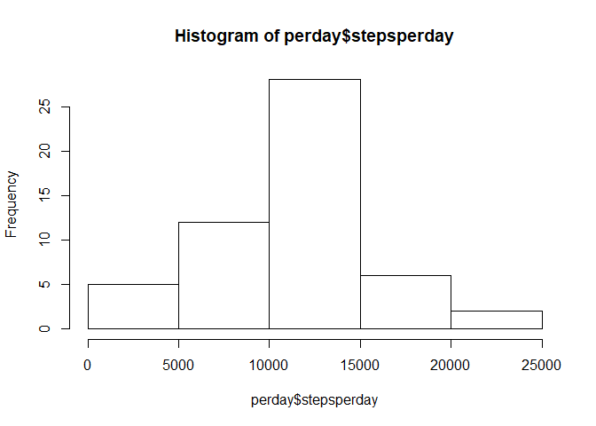
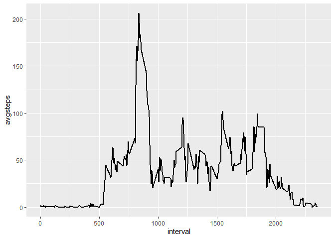
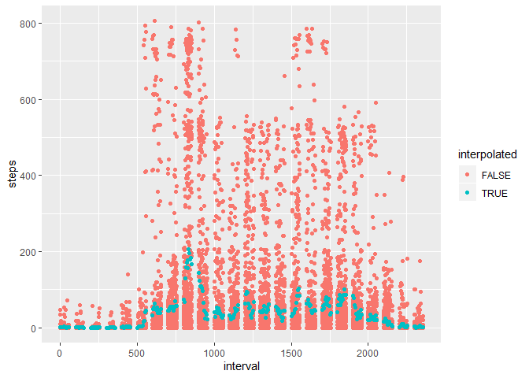
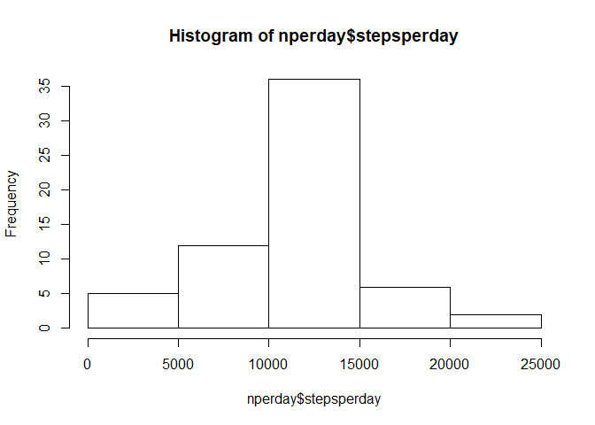
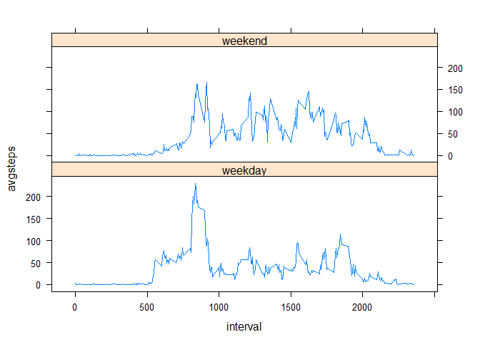

```r
library(dplyr)
library(ggplot2)
library(lattice)
```

## Loading and preprocessing the data
Data is stored in zip file. We are loading the data and examinig the data frame usint str():  

```r
dt<-read.csv(unz("activity.zip", "activity.csv"), header=T)
str(dt)
```

```
## 'data.frame':	17568 obs. of  3 variables:
##  $ steps   : int  NA NA NA NA NA NA NA NA NA NA ...
##  $ date    : Factor w/ 61 levels "2012-10-01","2012-10-02",..: 1 1 1 1 1 1 1 1 1 1 ...
##  $ interval: int  0 5 10 15 20 25 30 35 40 45 ...
```
We actualy want date column to be converted to Date type:

```r
dt$date <- as.Date(dt$date)
str(dt)
```

```
## 'data.frame':	17568 obs. of  3 variables:
##  $ steps   : int  NA NA NA NA NA NA NA NA NA NA ...
##  $ date    : Date, format: "2012-10-01" "2012-10-01" ...
##  $ interval: int  0 5 10 15 20 25 30 35 40 45 ...
```


## What is mean total number of steps taken per day?  

Using dplyr library functions, we sum all the steps for each day. NA values are ignored in this question:  

```r
perday <- dt %>% group_by(date) %>% summarise(stepsperday=sum(steps))
hist(perday$stepsperday)
```

<!-- -->

```r
ss<-summary(perday$stepsperday)
ss[3:4]
```

```
##   Median     Mean 
## 10765.00 10766.19
```


## What is the average daily activity pattern?
  
Using dplyr group_by and summarize we calculate average steps taken in 5min intervals, accross all days. We ommit NA values from mean calcultion.

```r
avgint <- dt %>% group_by(interval) %>% summarise(avgsteps = mean(steps, na.rm = T))
ggplot(avgint) +
  aes(interval, avgsteps) + 
  geom_line(size=1)
```

<!-- -->
  
Interval with highest avg step count is:  

```r
print(avgint[which.max(avgint$avgsteps),])
```

```
## # A tibble: 1 x 2
##   interval avgsteps
##      <int>    <dbl>
## 1      835     206.
```
## Imputing missing values

First, we summarise missing values in table and we want to mark interpolated entries - just for future reference.  


```r
table(is.na(dt$steps))
```

```
## 
## FALSE  TRUE 
## 15264  2304
```

```r
dt$interpolated = FALSE
dt$interpolated[is.na(dt$steps)] = TRUE
ndt<-dt
```

Then we generate the dataframe containig NA intervals and take values from avg set of intervals using left_join and finaly asign that to ndt, new data frame.


```r
nt<-data.frame(ndt$interval[is.na(ndt$steps)])
nt<-rename(nt,interval=1)
nt<-left_join(nt,avgint,by="interval")
ndt$steps[is.na(ndt$steps)] <- nt$avgsteps
```
We check that there are no more NA values and we plot the data, marking interpolated values in different collor:  


```r
table(is.na(ndt$steps))
```

```
## 
## FALSE 
## 17568
```

```r
ggplot(ndt) +
  aes(interval, steps, color = interpolated) + 
  geom_point()
```

<!-- -->

We summarise the new data and plot it on histogram to see the difference compared to orginal dataset:  

```r
nperday <- ndt %>% group_by(date) %>% summarise(stepsperday=sum(steps))
hist(nperday$stepsperday)
```

<!-- -->

```r
nss<-summary(nperday$stepsperday)
nss[3:4]
```

```
##   Median     Mean 
## 10766.19 10766.19
```
## Are there differences in activity patterns between weekdays and weekends?

First we create new factor variable, indicating wheater the day is weekday or weekend:  

```r
daysinweek<-data.frame("dnum"=1:7, "dname"=c("Mon", "Tue", "Wed", "Thu","Fri", "Sat", "Sun"), "dtype"=c("weekday","weekday","weekday","weekday","weekday","weekend","weekend"))
ndt$dname<-weekdays(ndt$date,abbreviate = T)
ndt<-left_join(ndt,daysinweek, by="dname")
```

```
## Warning: Column `dname` joining character vector and factor, coercing into
## character vector
```

```r
table(ndt$dtype)
```

```
## 
## weekday weekend 
##   12960    4608
```

Next we plot the avgerage steps per day, grouped on weekdays and weekends:  

```r
navgint <- ndt %>% group_by(interval, dtype) %>% summarise(avgsteps = mean(steps, na.rm = T))
xyplot(avgsteps~interval|dtype, data=navgint, type="a", layout = c(1, 2))
```

<!-- -->
